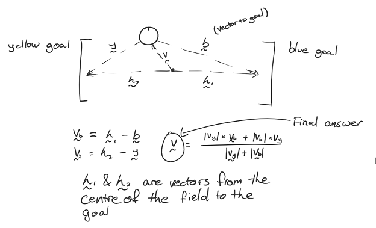
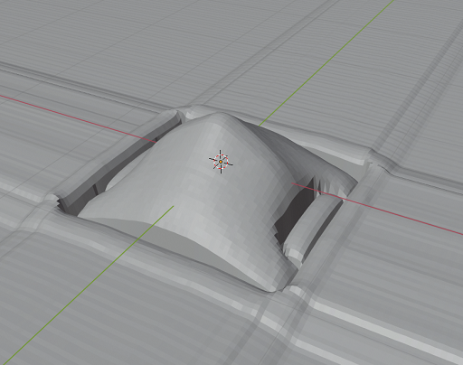

    
One of the biggest innovation Team Omicron brings this year is our advanced, custom developed vision and
localisation application called _Omicam_. Omicam handles the complex process of detecting the ball and goals, determining
the robot's position on the field as well as encoding/transmitting this information, in one codebase.

The application is developed mostly in C, with some C++ code to interface with OpenCV. 
It runs on the LattePanda Delta 432 single board computer and uses Linux (Xubuntu 18.04) as its OS.

We are proud to report that Omicam is a significant improvement compared to previous vision applications in use at BBC
Robotics, as explained in the "Performance and results" section.

## Background and previous methods
Intelligent, accurate and fast computer vision continues to become increasingly important in RoboCup Jr Open Soccer.
With the introduction of the orange ball and advanced teams' application of "ball-hiding" strategies, high resolution yet
performant computer vision is now one of the most important elements of a successful RoboCup Jr Open robot. However, detecting the
field objects (ball, goals, etc) is now only the bare minimum. Advanced teams also need to accurately estimate their 
position on the field (localise) in order to execute advanced strategies and gain the upper hand in the competition.

Previously, our team used an OpenMV H7 to provide vision. This is a module which uses an STM32 MCU combined combined with
an OmniVision camera module to provide low-resolution vision in an easy-to-use MicroPython environment. However, although
this approach is functional, its resolution and framerate are extremely limiting for our use case. Hence, we decided the
best solution was to do what the most advanced teams were doing, and develop a custom vision application running on a 
single board computer (SBC). In terms of localisation, in the past we managed to get away with not using any, or using
a low-fidelity approach based on detecting the goals in the image. With the introduction of strategies this year, however,
team members needed more accurate position data, which requires more complex localisation.

## Performance and results
**TODO provide some more empiric data (tables and stuff) here. Maybe also provide a Pitfalls section at the end.**

Omicam is capable of detecting the ball, goals and lines at 60-70fps at 720p (1280x720) resolution. 
Compared to the previous OpenMV H7, this is 23x higher resolution at 3x the framerate.1

In addition, using the novel vision-based localisation algorithm we developed this year, we can now determine the
robot's position to around 1.5cm accuracy at roughly 30 Hz. This is over 5x/25x more accurate2
than any previous methods used at BBC Robotics, and has been shown to be much more reliable and stable.

Using the e-con Systems Hyperyon camera based around the ultra low-light performance IMX290 sensor, Omicam
is robust against lighting conditions ranging from near pitch darkness to direct LED light.

_1 previous results based on mediocre lighting conditions running well optimised OpenMV H7 code at QVGA resolution._ 

_2 depending on whether LRF based/goal based localisation was used._

## Hardware
Omicam supports any single board computer (SBC) that can run Linux. In our case, we use a LattePanda Delta 432 with a 
2.4 GHz quad-core Intel Celeron N4100, 4GB RAM, 32GB of storage, WiFi, Bluetooth, gigabit Ethernet and a UART bus.

The current camera we use is an e-con Systems Hyperyon, based on the Sony Starvis IMX290 ultra low-light sensor capable
of seeing in almost pitch black at high framerates. This is a USB 2.0 camera module, since the LattePanda has no 
MIPI port.

### SBC iterations
The current iteration of Omicam's SBC setup is the cumulation of around 2 years of prototyping iterations in both
hardware and software approaches.

**Prototype 1 (December 2018-January 2019):** This consisted of a Raspberry Pi Zero W, with a 1 GHz single-core CPU.
It was our initial prototype for a single-board computer, however, we quickly found it was far too weak to do any vision,
and our inexperience at the time didn't help. Thus, we canned the SBC project for around a year.

**Prototype 2 (December 2019):** After resurrecting the SBC R&D project for our 2020 Internationals, we started development
with the Raspberry Pi 4. This has a 1.5 GHz quad-core ARM Cortex-A72 CPU. We began developing a custom computer vision
library tailored specifically to our task, using the Pi's MMAL API for GPU-accelerated camera decoding. Initial results
showed we could threshold images successfully, but we believed it would be too slow to localise and run a
connected-component labeller in real time.

**Prototype 3 (January 2020):** Next, we moved onto the NVIDIA Jetson Nano, containing a 1.43 GHz quad-core Cortex-A57,
but far more importantly a 128-core Maxwell GPU. At this time we also switched to using OpenCV 4 for our computer vision.
In theory, using the GPU for processing would lead to a huge performance boost due to the parallelism, however, in practice
we observed the GPU was significantly slower than even the weaker Cortex-A43 CPU, (presumably) due to copying times. We
were unable to optimise this to standard after weeks of development, thus we decided to move on from this prototype.

**Prototype 4 (January-February 2020):** After much research, we decided to use the LattePanda Delta 432. The OpenCV
pipeline is now entirely CPU bound, and despite not using the GPU at all, we are able to achieve good performance.

### Camera module iterations
In addition to the SBC, the camera module has undergone many iterations, as it's also an important element in the 
vision pipeline.

**Pi Camera:** The initial camera we used in hardware prototypes 1-3, was the Raspberry Pi Camera. 
In prototype 1, we used the Pi Cam v1.3 which is an OV5647 connected via MIPI, and in prototypes 2 and 3 we used the 
Pi Cam v2 which is an IMX219 again connected via MIPI. We had to drop this camera in later iterations because
the LattePanda doesn't have a MIPI port. Both of these cameras were capable of around 720p at 60 fps.

**OV4689-based module:** We experimented with a generic OV4689 USB 2.0 camera module from Amazon, which is capable of
streaming JPEGs (aka an MJPEG stream) at 720p at 120 fps (we could get around 90 fps in practice with no processing).
While this framerate was useful, the camera module suffered from noise and flickering in relatively good
lighting conditions, so it was dropped.

**e-con Hyperyon:** After these two failures, we began looking into industrial-grade cameras to use on
our robot. While most of these, from companies like FLIR, are out of our price range, we found e-con Systems as a
relatively affordable vendor of high quality cameras. We narrowed down our selection to two devices: the
See3CAM_CU30 USB 2/USB 3 2MP camera module, which is fairly standard and affordable, as well as the more expensive
Hyperyon described above. After testing both, we decided the Hyperon fit our needs better, despite its higher latency,
due to its extremely good low light performance.

## Field object detection
One of the responsibilities of Omicam is to detect the bounding box and centroid of field objects: the ball, goals and also lines. 
This is accomplished by using the open-source computer vision library OpenCV (v4.2.0). 
We use a Gstreamer pipeline to decode the camera's MJPEG stream at our target resolution of 1280x720 pixels, which is
read in through an OpenCV `VideoCapture` object.

### Pre-processing
With the camera frame in OpenCV memory, we then apply the following pre-processing steps to the image:

1. Crop the frame to only leave a rectangle around the mirror visible
2. Flip the image, if necessary, to account for the mounting of the camera on the robot
3. Apply a circular mask to the image to mask out any pixels that aren't exactly on the mirror
4. Downscale the frame for use when processing the blue and yellow goals, since we don't need much accuracy on them and they're large.
5. (only for the field lines) Mask out the robot from the centre of the mirror (as it has reflective plastic on it which comes up as white)

### Thresholding and component labelling
After pre-processing, we then use OpenCV's `parallel_for` and `inRange` functions to threshold three objects at once using
three threads (ideally one free core is left for the localisation). 
This produces a 1-bit binary mask of the image, where each pixel is 255 (true) if it's inside the RGB range specified, 
and 0 (false) if it's not.

For the lines, the vision processing step is finished here as we only need a binary mask. Unfortunately, the localisation
process can't begin until the goals have finished processing due to the localiser relying on the goals in its initial
estimate calculations (see below).

Finally, we use OpenCV's Grana[^1] parallel connected component labeller to detect regions of the same colour in the image.
The largest connected region will be the field object we are looking for. 
OpenCV automatically calculates the bounding box and centroid for each of these connected regions.

### Coordinate transforms and dispatch
Considering the centroid for each field object as a Cartesian vector in pixels coordinates, we convert this vector to
polar form and run the magnitude through our mirror dewarping function (see below) to convert it to a length in 
centimetres. This leaves us with a polar vector for each field object relative to the robot's centre.

We then convert back to Cartesian and use the last localiser position to infer the field object's absolute position in centimetres. 

Finally, for the goals we also calculate the relative Cartesian coordinates (convert polar to Cartesian but don't add 
localiser position) for use in the localiser's initial estimate calculations.

This information is encoded into a Protobuf format with nanopb, and is sent over UART to the ESP32 using POSIX termios
at 115200 baud. Unfortunately, the UART bus is owned by an ATMega 32U4, so a sketch on that device forwards it
to the ESP32.

**TODO images and/or video of thresholded field**

**TODO more detail on dewarp function here (maybe move stuff up from localisation section)**

## Localisation
### Previous methods and background
Localisation is the problem of detecting where the robot is on the field. This information is essential to know in order
to develop advanced strategies and precise movement control, instead of just driving directly towards the ball.

Currently, teams use three main methods of localisation. Firstly, the most common approach uses the detected goal blobs
in the camera to triangulate the robot's position. This approach can be very inaccurate because of the low resolution of
most cameras (such as the OpenMV), the fact that there are only two goals to work with as well as the fact that sometimes
the goals are not visible (especially in SuperTeam). Using this approach on an OpenMV, we found accuracy of about 15 cm,
but running on Omicam at 720p we found accuracy of around 4-6 cm.

The second approach in use is based on distance sensors such laser range finders (LRFs) or ultrasonic sensors. By using
a few of these sensors on a robot, the position of the robot can be inferred with trigonometry by measuring the distance
to the walls. The drawback of this approach is that it's impossible to reliably distinguish between interfering objects,
such as a hand or another robot, compared to a wall. This means that although this approach can be accurate on an empty
field, it is very difficult to use reliably in actual games. On an empty field, teams have found accuracies of 5-10 cm,
but data is often invalid and can't be used reliably in real games.

The third approach in use by some teams is one based on 360 degree LiDARS. This approach, being similar to the second
approach, has similar accuracy and drawbacks. One additional drawback is the expensive cost and heavy weight of LiDARS.

Another approach that can be used is summing displacement values from a mouse sensor, or integrating acceleration data
from an IMU. While these approaches have high levels of accuracy initially, the repeated integration of the data 
gradually builds error over time, and if the robot is on for a particularly long time, the localised position may be
several centimetres inaccurate by the end. In addition, these approaches all return relative displacement to the 
initial position, not an absolute position on the field - meaning a method for calculating the robot's initial
position accurately is still required.

Some teams, including us in the past, do not localise at all. Strictly speaking, with many gameplay behaviours,
knowing the robot's position is not necessary. However, with our advanced strategies, localisation is a necessity.

### Our approach
This year, Team Omicron presents a novel approach to robot localisation based on a hybrid
sensor-fusion/non-linear optimisation algorithm.
Our approach builds an initial estimate of the robot's position using faster, more inaccurate methods like goal
triangulation and mouse sensor displacement.
It then refines this estimate to a much higher accuracy by solving a 2D non-linear optimisation problem in realtime.
The addition of the optimisation stage to the algorithm increases accuracy by about 4.6x, to be as little as 1.5cm error.

Our optimisation algorithm works by comparing observed field line geometry from the camera (sampled via raycasting), 
to a known model of the field. By trying to optimise the robot's unknown (x,y) position such that it minimises 
the error between the observed lines and expected lines at each position, we can infer the robot's coordinates to a 
very high level of accuracy.

The optimisation stage of our sensor fusion algorithm is based on a paper by Lauer, Lange and Redmiller (2006) [^2],
as covered in the paper by Lu, Li, Hu and Zheng (2013) [^3].

However, our approaches are different in certain areas, with us making some concessions and improvements to better suit
the RoboCup Junior league (as the paper was written for middle-size league). Lauer et al's approach casts rays and
marks points where these rays intersect the lines, whereas we work with these rays and their lengths directly. Their
approach also calculates the orientation of the robot, while we trust the value of the IMU for orientation to simplify
our algorithm. Their optimisation stage uses the RPROP algorithm to minimise error, while we use Subplex (based on
the Nelder-Mead simplex algorithm). Finally, Lauer et al's approach has more complex global localisation and smoothing
that can handle unstable localisations with multiple local minima, while our approach assumes only one minimum is
present in the objective function.

Our approach has the following 4 main steps:

1. Estimate calculation
3. Image analysis
4. Camera normalisation
4. Coordinate optimisation and interpolation

### Estimate calculation
The localiser first constructs an initial estimate of the robot's position using faster but more inaccurate methods.
The preferred method is to sum the displacement data from our PWM3360 mouse sensor to determine our current position 
since last localisation. However, in certain cases such as the initial localisation after the robot is powered on,
we also use the blue and yellow goals to triangulate our position since there's no initial position for the mouse 
sensor to use. Once we have an initial localisation though, we can go back to using the mouse sensor data.

    
_Figure 1: method for triangulating position using goals coordinates and vectors_

Once the initial estimate is calculated, which is usually accurate to about 6-10cm, we constrain the optimiser's bounds
to a certain sized rectangle around the centre of the estimated position. We also change the optimiser's initial
estimate position to the estimated position, and scale down its step size significantly. We assume that the estimate
is close to the actual position, so a smaller step size means that it won't overshoot the minimum and will hopefully
converge faster. The combination of the estimate bounds with changing localiser settings means that we can often
stably converge on the real position of the robot with around 40 objective function evaluations.

If the localiser isn't constrained to the initial estimate bounds, especially on the internationals field we found it
could be very unstable and would often get stuck in nonsensical positions like the corners of the field or inside
the goals. Constraining the optimiser to the estimate bounds is very helpful to reduce these problems.

### Image analysis
The localiser's input is a 1-bit mask of pixels that are determined to be on field lines. This is determined by thresholding
for the colour white, which is handled by the vision pipeline described earlier.

With the input provided, a certain number of rays (usually 64) are emitted from the centre of the line image. A ray
terminates when it touches a line, reaches the edge of the image or reaches the edge of the mirror (as it would be a
waste of time to check outside the mirror). Currently we use simple trigonometry to project this ray, although we could
use the Bresenham line algorithm for more performance.

Rays are stored as only a length in a regular C array, as we can infer the angle between each ray as: 2pi / n_rays

This step can be summarised as essentially "sampling" the line around us on the field.

   
_Figure 2: example of ray casting on field, with a position near to the centre_

### Camera normalisation
These rays are then dewarped to counter the distortion of the 360 degree mirror. The equation to do so is determined by
measuring the pixels between points along evenly spaced tape placed on the real field, via Omicontrol. Using regression 
software such as Excel or Desmos, an equation can then be calculated to map pixel distances to real distances. 
In our case, we simply apply the dewarp function to each ray length instead, leaving us
with each ray essentially in field coordinates (or field lengths) rather than camera coordinates.

This dewarping equation is also used by the vision pipeline to determine the distance to the ball and goals in centimetres.

    
_Figure 3: example of applying the dewarp function to an entire image, on the low resolution OpenMV H7._

The second phase of the camera normalisation is to rotate the rays relative to the robot's heading, using a rotation matrix.
The robot's heading value, which is relative to when it was powered on, is transmitted by the ESP32 (again using Protocol Buffers).
For information about how this value is calculated using the IMU, see the ESP32 and movement code page.

### Coordinate optimisation and interpolation
The coordinate optimisation stage is achieved by using the Subplex local derivative-free non-linear optimisation algorithm
[^4], re-implemented as part of the NLopt package[^5]. 
This algorithm essentially acts as an efficiency and stability improvement over the well-known Nelder-Mead Simplex algorithm.

**Talk more about numerical optimisation here? compared to solving**

Our problem description is as follows: (**TODO not correct**)

The most important part of this process is the _objective function_, which is a function that takes an N-dimensional vector
(in our case, an estimated 2D position) and calculates essentially a "score" of how accurate the value is. This
objective function must be highly optimised as it could be evaluated hundreds of times by the optimisation algorithm.

   
_Figure 4: map of objective function for a robot placed at the centre of the field. White pixels indicate high accuracy areas_
_and black pixels indicate less accurate areas. This takes up to 30 seconds to calculate for all 44,226 positions._

    
_Figure 5: if we treat the value of the objective function as a heightmap, we can also generate a 3D visualisation of it_

The known geometry of the RoboCup field is encoded into a "field file". This is a binary Protcol Buffer file that encodes the 
geometry of any RoboCup field (including SuperTeam) by dividing it into a grid, where each cell is true if on a line, otherwise false. 
Increasing the resolution of the grid will increase its accuracy, but also increase its file size. We use a 1cm grid,
which stores 44,226 cells and is 42 KiB on disk. This takes about 2 seconds to generate on a fast desktop computer, and
is copied across to the LattePanda SBC.
The field file is generated by a Python script which can be easily modified to support an arbitrary number of different 
field layouts, such as SuperTeam or our regional Australian field. 

    
_Figure 6: visualisation of the field data component of the field file. In the original 243x182 image, 1 pixel = 1cm_

Although a derivative-based algorithm may be more efficient at solving the problem, we could not determine a way to
calculate the derivative of the objective function in a way that was easier than just using a derivative-free
algorithm. Especially considering the low dimensionality of the problem, a derivative-based algorithm wasn't really
required.

With the robot's position now determined to the highest accuracy possible, the final step in the localisation process
is to smooth and interpolate this coordinate. The optimisation algorithm can produce unstable results, especially in
environments where the line is not very visible or mistaken for other objects on the field. Smoothing is currently 
accomplished by using a simple moving average. A moving median was also tried but led to more unstable results. 
In future, we would like to investigate more complex digital signal processing such as a low-pass filter or Kalman filter
to improve our accuracy.

**TODO cover dynamic size of moving mean when it's added**

### Limitations and refinements
Although a lot of effort has been spent improving the performance of our approach, some issues with it remain:

- Accuracy can still be improved. Although 1.5cm is good, it's still a margin of error that may make some more precise
movements difficult.
- The algorithm can be unstable, especially on internationals fields where lines are harder to see. The initial estimate
stage and optimiser bounds helps to correct this, but a better algorithm for detecting lines (perhaps using a Sobel filter)
should be looked into.
- On a related note, the optimiser probably needs too many lines visible to generate a stable position. In fact, this
limitation is what led us to develop the hybrid sensor-fusion/optimisation algorithm instead of just optimising
directly. In the real world, just optimising was too unstable when lines weren't visible, compared to idealistic
simulation renders.
- The optimisation stage is still slow, even with only 40 or so objective function evaluations. In the Nelder-Mead simplex
algorithm (which Subplex is based on), the evaluation of the simplex's vertices could be multi-threaded to speed it up if
more CPU cores were available. May also be possible to run this algorithm on the GPU, if we had one.
- The algorithm is difficult to debug. Despite programming tools for Omicontrol, it's still difficult to determine exactly
why the algorithm won't localise sometimes, which could be a problem at competitions. Although this is expected from a 
complex approach, more debugging tools should be programmed to assist with this.
- To generate a better final position, a low pass filter or even Kalman filter could be used instead of a simple moving
average.

## Extra/miscellaneous features
### Interfacing with Omicontrol
To interface with our remote management application Omicontrol, Omicam starts a TCP server on port 42708. This server sends
Protocol Buffer packets containing JPEG encoded frames, zlib compressed threshold data as well as other information such as
the temperature of the SBC. The TCP listen thread receives messages from the Omicontrol client, decodes them and executes
the specified action ID (for example, save data to disk) if one is specified. The TCP send thread receives data from
the vision and localisation pipelines, and encodes them an sends them over network.

We use the SIMD optimised libjpeg-turbo to efficiently encode JPEG frames, so as to not waste performance on the remote 
debugger (which is disabled during competition). Instead of compressing threshold frames with JPEG, because they are 1-bit 
images, it was determined that zlib could compress them more efficiently (around about 460,800x reduction in size compared 
to uncompressed data). 

With all these optimisations, even at high framerates (60+ packets per second), the remote debug system uses no more than
1 MB/s of outgoing bandwidth, which is small enough to work reliably over both Ethernet and WiFi.

### Configuration
Usually, we embed configuration in a "defines.h" file. Config includes information like the bounding box of the crop
rectangle, the radius of the mirror and the dewarp function.

Because this is embedded in a header, the project would have to be recompiled and relaunched every time a setting is updated
which is not ideal. For Omicam, we used an INI file stored on the SBC's disk that is parsed and loaded on every startup.

In addition, the config file can also be dynamically reloaded by an Omicontrol action, making even relaunching Omicam un-necessary. 
Because of this, we have much more flexibility and faster prototyping abilities when tuning to different venues.

### Video recording and match replay
Omicam can record its vision output to disk as an mp4 file. When this is enabled in the configuration, a thread is started
that writes video frames to an OpenCV `VideoWriter` at the correct framerate to produce a stable 60 fps video. These
generated videos can be loaded as Omicam input (instead of using a live camera), thus enabling a capture and replay system.

In this way, games can be recorded for later analysis of Omicam's performance and accuracy, or for entertainment value.

### Debugging and performance optimisation
**TODO we may use gcc not clang so talk about that too**

To achieve Omicam's performance, we made heavy use of parallel programming techniques, OpenCV's x86 SIMD CPU optimisations,
Clang optimiser flags as well as image downscaling for the goal threshold images (as they are mostly unused).
In addition, the localisation, vision and remote debug pipelines all run in parallel to each other so the entire application
is asynchronous.

Low-level compiled languages such as C and C++ can be difficult to debug when memory corruption or undefined behaviour
issues manifest. In addition, many latent bugs can go undetected in code written in these languages.
In order to improve the stability of Omicam
and fix bugs, we used Google's Address Sanitizer (ASan) and Undefined Behaviour Sanitizer (UBSan) to easily find and trace a variety of bugs such as buffer overflows, memory leaks and more. 
In addition, we used the LLVM toolchain's debugger lldb (or just gdb) to analyse the application frequently.

To assist in performance evaluation, we used the Linux tool OProfile to determine the slowest method calls in the application.
Although the Clang compiler may have marginally worse performance than GCC, we chose Clang because it's more modern and has
better debugging support (namely, GCC's Adress Sanitizer implementation is broken for us).

To improve performance of the localiser, we use the last extrapolated position from the mouse sensor as a seed for the initial
position of the next search. This means instead of starting from a random position, the localiser will complete much quickly
a it's already relatively close to the true position.

**Also cover Linux CPU optimisation and associated thermal issues if relevant**

## References
[^1]: C. Grana, D. Borghesani, and R. Cucchiara, “Optimized Block-Based Connected Components Labeling With Decision Trees,” IEEE Trans. Image Process., vol. 19, no. 6, pp. 1596–1609, 2010, doi: 10.1109/TIP.2010.2044963.

[^2]: Lauer, M., Lange, S. and Riedmiller, M., 2006. Calculating the Perfect Match: An Efficient and Accurate Approach for Robot Self-localization. RoboCup 2005: Robot Soccer World Cup IX, pp.142-153.

[^3]: H. Lu, X. Li, H. Zhang, M. Hu, and Z. Zheng, “Robust and real-time self-localization based on omnidirectional vision for soccer robots,” Adv. Robot., vol. 27, no. 10, pp. 799–811, Jul. 2013, doi: 10.1080/01691864.2013.785473.

[^4]: T. H. Rowan, “Functional stability analysis of numerical algorithms,” Unpuplished Diss., p. 218, 1990.

[^5]: Steven G. Johnson, The NLopt nonlinear-optimization package, http://github.com/stevengj/nlopt