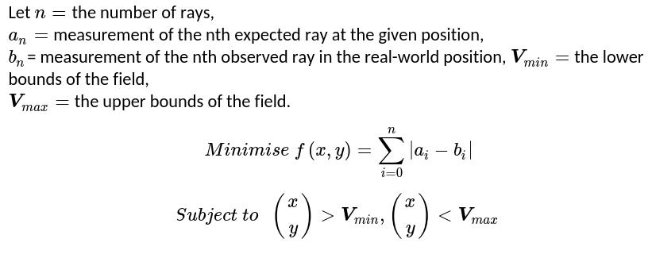

# Omicam 
One of the biggest innovation Team Omicron brings this year is our advanced, custom developed vision and
localisation application called _Omicam_. The application is developed mostly in C, with some C++ code to interface with
OpenCV. It runs on the powerful LattePanda Delta 432 single board computer and uses Linux (Xubuntu 18.04) as its OS.

We are proud to report that Omicam is a significant step up compared to previous vision applications in use at BBC
Robotics, as explained in the "Performance and results" section.

## Background and previous methods
Intelligent, accurate and fast computer vision continues to become increasingly important in RoboCup Jr Open Soccer.
With the introduction of the orange ball and advanced teams' application of "ball-hiding" strategies, high resolution yet
performant computer vision is now one of the most important elements of a successful RoboCup Jr Open robot. However, detecting the
field objects (ball, goals, etc) is now only the bare minimum. Advanced teams also need to accurately estimate their 
position on the field (localise) in order to execute advanced strategies and gain the upper hand in the competition.

Previously, our team used an OpenMV H7 to provide vision. This is a module which uses an STM32 MCU combined combined with
an OmniVision camera module to provide low-resolution vision in an easy-to-use MicroPython environment. However, although
this approach is functional, its resolution and framerate are extremely limiting for our use case. Hence, we decided the
best solution was to do what the most advanced teams were doing, and develop a custom vision application running on a 
single board computer (SBC). In terms of localisation, in the past we managed to get away with not using any, or using
a low-fidelity approach based on detecting the goals in the image.

## Performance and results
**TODO provide some more empiric data (tables and stuff) here. Maybe also provide a Pitfalls section at the end.**

Omicam is capable of detecting the ball, both goals and lines at **60-70fps at 720p (1280x720) resolution**. 
Compared to the previous OpenMV H7, this is **23x higher resolution at 3x the framerate.1**

In addition, using the novel vision-based localisation algorithm we developed this year, we can now determine the
robot's position to around **1.5cm accuracy** at roughly 30 Hz. This is over **5x/25x more accurate2** 
than any previous methods used at BBC Robotics, and has been shown to be much more reliable and stable.

Using the e-con Systems Hyperyon camera based around the ultra low-light performance IMX290 sensor, Omicam
is robust against lighting conditions ranging from near pitch darkness to direct LED light.

_1 previous results based on mediocre lighting conditions running well optimised OpenMV H7 code at QVGA resolution._ 

_2 depending on whether LRF based/goal based localisation was used._

## Hardware
Omicam supports any single board computer (SBC) that can run Linux. In our case, we use a LattePanda Delta 432 with a 
2.4 GHz quad-core Intel Celeron N4100, 4GB RAM, 32GB of storage, WiFi, Bluetooth, gigabit Ethernet and a UART bus.

The current camera we use is an e-con Systems Hyperyon, based on the Sony Starvis IMX290 ultra low-light sensor capable
of seeing in almost pitch black at high framerates. This is a USB 2.0 camera module, since the LattePanda has no 
MIPI port.

### SBC iterations
The current iteration of Omicam's SBC setup is the cumulation of around 2 years of prototyping iterations. Each
of the previous SBCs we tried have had one problem or another, and we believe the LattePanda Delta is the most powerful yet
cost efficient approach.

**Prototype 1 (December 2018-January 2019):** This consisted of a Raspberry Pi Zero W, with a 1 GHz single-core CPU.
It was our initial prototype for a single-board computer, however, we quickly found it was far too weak to do any vision,
and our inexperience at the time didn't help. Thus, we canned the SBC project for around a year.

**Prototype 2 (December 2019):** After resurrecting the SBC R&D project for our 2020 Internationals, we started development
with the Raspberry Pi 4. This has a 1.5 GHz quad-core ARM Cortex-A72 CPU. We began developing a custom computer vision
library tailored specifically to our task, using the Pi's MMAL API for GPU-accelerated camera decoding. Initial results
showed we could threshold images successfully, but we believed it would be too slow to localise and run a
connected-component labeller in real time.

**Prototype 3 (January 2020):** Next, we moved onto the NVIDIA Jetson Nano, containing a 1.43 GHz quad-core Cortex-A57,
but far more importantly a 128-core Maxwell GPU. At this time we also switched to using OpenCV 4 for our computer vision.
In theory, using the GPU for processing would lead to a huge performance boost due to the parallelism, however, in practice
we observed the GPU was significantly slower than even the weaker Cortex-A43 CPU, (presumably) due to copying times. We
were unable to optimise this to standard after weeks of development, thus we decided to move on from this prototype.

**Prototype 4 (January-February 2020):** After much research, we decided to use the LattePanda Delta 432. The OpenCV
pipeline is now entirely CPU bound, and despite not using the GPU at all, we are able to achieve good performance.

### Camera module iterations
We have spent a great deal of time and money trying to find the absolute best camera module to use in our hardware
setup. After all, no matter how good our software may be, we are still limited by the quality of our image sensor.

**Pi Camera:** The initial camera we used in hardware prototypes 1-3, was the Raspberry Pi Camera. 
In prototype 1, we used the Pi Cam v1.3 which is an OV5647 connected via MIPI, and in prototypes 2 and 3 we used the 
Pi Cam v2 which is an IMX219 again connected via MIPI. We had to drop this camera in later iterations because
the LattePanda doesn't have a MIPI port. Both of these cameras were capable of around 720p at 60 fps.

**OV4689-based module:** We experimented with a generic OV4689 USB 2.0 camera module from Amazon, which is capable of
streaming JPEGs (aka an MJPEG stream) at 720p at 120 fps (we could get around 90 fps in practice with no processing).
While this framerate was impressive, the camera module suffered from terrible noise and flickering in relatively good
lighting conditions, so it was dropped.

**e-con Hyperyon:** After these two failures, we began looking into professional industrial-grade cameras to use on
our robot. While most of these, from companies like FLIR, are out of our price range, we found e-con Systems as a
relatively affordable vendor of extremely high quality cameras. We narrowed down our selection to two devices: the
See3CAM_CU30 USB 2/USB 3 2MP camera module, which is fairly standard and affordable, as well as the more expensive
Hyperyon described above. Using our contacts at CSIRO, we managed to acquire a sample of some of the e-con cameras
they used including the Hyperyon and a device similar to the CU30. While both can do 720p at 60 fps, we observed
absolutely fantastic lighting performance from the Hyperyon but 100ms latency, while mediocre lighting performance
from the CU30 but 60ms latency. After much deliberation, we decided to make the difficult trade-off to prioritise
lighting over latency and use the Hyperyon.

## Field object detection
The primary responsibility of Omicam is to detect the bounding box and centroid of field objects: the ball, goals and also lines. 
To do this, we use the popular computer vision library OpenCV (v4.2.0). 
We use a Gstreamer pipeline to decode the camera's MJPEG stream at our target resolution of 1280x720 pixels, and with
OpenCV's `VideoCapture` this is copied across to OpenCV code.

### Pre-processing
With the camera frame in OpenCV memory, we then apply the following pre-processing steps to the image:

1. Crop the frame to only leave a rectangle around the mirror visible
2. Flip the image, if necessary, to account for the mounting of the camera on the robot
3. Apply a circular mask to the image to mask out any pixels that aren't exactly on the mirror
4. Downscale the frame for use when processing the blue and yellow goals, since we don't need much accuracy on them and they're large.
5. (only for the field lines) Mask out the robot from the centre of the mirror (as it has reflective plastic on it which comes up as white)

### Thresholding and component labelling
After pre-processing, we then use OpenCV's `parallel_for` and `inRange` functions to threshold three objects at a time using
three threads (one free core is left for the localisation, although Linux may schedule threads differently). This produces
a 1-bit binary mask of the image, where each pixel is 255 (true) if it's inside the RGB range specified, and 0 (false) if it's not.

Finally, we use OpenCV's parallel connected component labeller, specifically the algorithm by Grana et al.[^1] to detect regions
of the same colour in the image. The largest connected region will be the field object we are looking for. OpenCV automatically
calculates the bounding box and centroid for each of these connected regions.

For the lines, the vision processing step is finished here as we only need a binary mask.

### Coordinate transforms and dispatch
Considering the centroid for the ball and goals as a Cartesian vector in pixels coordinates, we convert this vector to
polar form and run the magnitude through our mirror dewarping function (see below) to convert it to centimetres. This
leaves us with an angle and distance to each object. We then convert it back to Cartesian and use the last localiser
position to get the field object's absolute position in centimetres. Finally, for the goals we also calculate the relative
Cartesian coordinates (convert polar to Cartesian but don't add localiser position) for use in the localiser's initial
estimate calculations.

This information is encoded into a Protobuf format with nanopb, and is sent over UART to the ESP32 using POSIX termios.

**TODO images and/or video of thresholded field**

**TODO more detail on dewarp function here (maybe move stuff up from localisation section)**

## Localisation
### Previous methods and background
Localisation is the problem of detecting where the robot is on the field. This information is essential to know in order
to develop advanced strategies and precise movement control, instead of just driving directly towards the ball.

Currently, teams use three main ways of localisation. Firstly, the simplest approach uses the detected goals
in the camera to estimate the robot's position. This approach is very inaccurate because of the low resolution of
most cameras (such as the OpenMV), the fact that there are only two goals to work with as well as the fact that sometimes
the goals are not visible (especially in super team). Expected accuracy is 15+ cm on an OpenMV, but using a similar approach
we got about 4-6 cm accuracy using Omicam at 720p. Although it's inaccurate, this is the approach most teams use in localisation.

The second approach in use is based on distance sensors such laser range finders (LRFs) or ultrasonic sensors. By using
a few of these sensors on a robot, the position of the robot can be inferred with trigonometry by measuring the distance
to the walls. This approach has a major drawback: it is impossible to reliably distinguish between anomalous objects,
such as a hand or another robot, compared to a wall. This means that although this approach is somewhat accurate on an empty
field, it is very difficult to use reliably in actual games. Thus, localisation data was almost never trusted by teams
who used this approach and so is not very helpful. In addition, distances sensors, especially ultrasonics, are slow and suffer 
from inaccuracy at long distances. Expected accuracy is 5-10cm, but data is often invalid and can't be used well in practice.

The third approach in use by some teams is one based on 360 degree LiDARS. These are expensive, heavy, difficult to use, slow and are
still vulnerable to all the problems the second approach suffers from as well. We are not aware of expected accuracy, but regard
this as not an ideal approach.

The final approach is to not localise at all. This is the method most teams use, including us in the past, and works by
simply manoeuvring directly to the ball. Until advanced strategies start being worked on, knowing the robot's position
on the field is just a "nice to have" and not strictly necessary. However, with the introduction of strategies this year,
we decided it was necessary to improve our localisation.

### Our solution
This year, Team Omicron presents a novel approach to robot localisation using a custom-developed sensor fusion algorithm.
Our approach builds an initial estimate of the robot's position using traditional methods such as visual positioning using
vector calculations on the field goal positions, and summing the displacements of a PWM3360 mouse sensor. 
It then refines this estimate to a much higher accuracy value using another novel algorithm that solves a 2D non-linear
optimisation problem. Compared to just using the aforementioned goal vector maths, the addition of the optimisation step increases 
accuracy by about 4.6x, to be as little as 1.5cm error. We believe an approach of this complexity and accuracy to be a first 
for the RoboCup Junior league.

The optimisation stage of our sensor fusion algorithm is based on a Middle-Size League paper published in _Advanced Robotics_[^2]. 
However, there are some differences between their paper and our approach. While they generate line points and then 
use a particle filter (Monte-Carlo localisation), we instead cast rays over the image and solve a non-linear minimisation problem
based on ray distances, rather than point locations. However, both methods generally follow the same approach of sampling 
the line and solving an optimisation problem to figure out the location of the robot. 

Our optimisation algorithm works by comparing observed field line geometry from the camera (sampled via raycasting), and 
comparing this to a known model of the field. By trying to optimise the robot's unknown (x,y) position such that they minimise 
the error between the observed lines and virtual lines, we can infer the robot's coordinates to very high accuracies.

In theory, this optimisation algorithm can already solve our localisation problem, and we did indeed observe very good
accuracy using idealistic Fusion 360 rendered images such as the one above **(TODO provide picture)**.
However, in the real world, we found the optimiser to be incredibly unstable, because the perspective of our camera's 
mounting obscures very far away field lines that the optimiser needs to converge on a stable solution. 
To solve this issue, we decided to use other lower-accuracy, but more robust estimates of the robot's position to 
"give hints" to the optimisation algorithm, thus forming a sensor fusion approach.

1. Estimate calculation
3. Image analysis
4. Camera normalisation
4. Coordinate optimisation

#### Estimate calculation
**Goal maths, mouse sensor**

#### Image analysis
**We use rays to sample the lines basically**

The localiser's input is a 1-bit mask of pixels that are determined to be on field lines. This is determined by thresholding
for the colour white, which is handled by the vision pipeline described earlier.

With the input provided, a certain number of rays (usually 128) are emitted from the centre of the line image. A ray
terminates when it touches a line, reaches the edge of the image or reaches the edge of the mirror (as it would be a
waste of time to check outside the mirror). The theory of operation behind this is, essentially, for each field position
each ray should have its own unique distance.

Rays are stored as only a length in a regular C array, as we can infer the angle between each ray as: 2pi / n_rays

   
_Figure 1: example of ray casting on field, with a position near to the centre_

#### Camera normalisation
These rays are then dewarped to counter the distortion of the 360 degree mirror. The equation to do so is determined by
measuring the pixels between points along evenly spaced tape placed on the real field, via Omicontrol. Using regression 
software such as Excel or Desmos, an equation can then be calculated to map pixel distances to real distances. 
In our case, we simply apply the dewarp function to each ray length instead, leaving us
with each ray essentially in field coordinates (or field lengths) rather than camera coordinates.

This dewarping equation is also used by the vision pipeline to determine the distance to the ball and goals in centimetres.

    
_Figure 2: example of applying the dewarp function to an entire image, on the low resolution OpenMV H7._

The second phase of the camera normalisation is to rotate the rays relative to the robot's heading, using a rotation matrix.
The robot's heading value, which is relative to when it was powered on, is transmitted by the ESP32, again using Protocol Buffers.
For information about how this value is calculated using the IMU, see the ESP32 and movement code page.

#### Position optimisation
The main part of our solution is the Subplex local derivative-free non-linear optimiser[^3], re-implemented as 
part of the NLopt package[^4]. This algorithm essentially acts as an efficiency and stability improvement over the well-known 
Nelder-Mead Simplex algorithm.

Our problem description is as follows:

The most critical part of this process is the _objective function_, which is a function that takes an N-dimensional vector
(in our case, an estimated 2D position) and calculates essentially a "score" of how accurate the value is. This
objective function must be highly optimised as it could be evaluated hundreds of times by the optimisation algorithm.

   
_Figure 3: map of objective function for a robot placed at the centre of the field. White pixels indicate high accuracy areas_
_and black pixels indicate less accurate areas. This takes up to 30 seconds to calculate for all 44,226 positions._

The known geometry of the RoboCup field is encoded into a "field file". This is a binary Protcol Buffer file that encodes the 
geometry of any RoboCup field (including SuperTeam) by dividing it into a grid, where each cell is true if on a line, otherwise false. 
Increasing the resolution of the grid will increase its accuracy, but also significantly increase its file size. We use a 1cm grid,
which stores 44,226 cells and is 42 KiB on disk. This takes about 2 seconds to generate on a fast desktop computer, and
is copied across to the LattePanda.
The field file is generated by a Python script which can be easily modified to support an arbitrary number of different 
field layouts, such as SuperTeam or our regional Australian field. 

    
_Figure 3: visualisation of the field data component of the field file. In the original 243x182 image, 1 pixel = 1cm_

Although a derivative-based algorithm may be more efficient at solving the problem, we deemed it far too difficult to calculate
the derivative of the objective function.

## Extra/miscellaneous features
### Interfacing with Omicontrol
To interface with our remote management application Omicontrol, Omicam starts a TCP server on port 42708. This server sends
Protocol Buffer packets containing JPEG encoded frames, zlib compressed threshold data as well as other information such as
the temperature of the SBC. Although C isn't an officially supported language by Google for Protocol Buffers, we use the mature
nanopb library to do the encoding. This is the same library used on the ESP32 and Teensy as well, and so far we've had no
issues with it.

We use the SIMD optimised libjpeg-turbo to efficiently encode JPEG frames, so as to not waste performance to the remote debugger
(which is disabled during competition). Instead of compressing threshold frames with JPEG, because they are 1-bit images,
it was determined that zlib could compress them more efficiently (around about 460,800x reduction in size). 

With all these optimisations, even at high framerates (60+ packets per second), the remote debug system uses no more than
1 MB/s of outgoing bandwidth, which is small enough to work reliably on both local and Internet networks.

### Configuration
Usually, we embed configuration in a "defines.h" file. Config includes information like the bounding box of the crop
rectangle, the radius of the mirror and the dewarp function.

Because this is embedded in a header, the project would have to be recompiled and relaunched every time a setting is updated
which is not ideal. For Omicam, we used an INI file stored on the SBC's disk that is parsed and loaded on every startup.

In addition, the config file can also be dynamically reloaded by an Omicontrol action, making even relaunching Omicam un-necessary. 
Because of this, we have much more flexibility and faster prototyping abilities when tuning to different venues.

### Video recording and match replay
**TODO explain this**

### Debugging and performance optimisation
To achieve Omicam's performance, we made heavy use of parallel programming techniques, OpenCV's x86 SIMD CPU optimisations,
Clang optimiser flags as well as intelligent image downscaling for the goal threshold images (as they are mostly unused).
In addition, the localisation, vision and remote debug pipelines all run in parallel to each other so the entire application
is asynchronous.

Low-level compiled languages such as C and C++ are notoriously unstable and difficult to debug. In order to improve the stability of Omicam
and fix bugs, we used Google's Address Sanitizer (ASan) and Undefined Behaviour Sanitizer (UBSan) to easily find and trace a variety of 
bugs such as buffer overflows, memory leaks and more. 
In addition, we used the LLVM toolchain's debugger lldb (or just gdb) to analyse the application frequently.

To assist in performance evaluation, we used the Linux tool OProfile to determine the slowest method calls in the application.
Although the Clang compiler may have marginally worse performance than GCC, we chose Clang because it's more modern and has
better debugging support (namely, GCC's Adress Sanitizer implementation is broken for us).

To improve performance of the localiser, we use the last extrapolated position from the mouse sensor as a seed for the initial
position of the next search. This means instead of starting from a random position, the localiser will complete much quickly
a it's already relatively close to the true position.

**Also cover Linux CPU optimisation and associated thermal issues if relevant**

## References
[^1]: C. Grana, D. Borghesani, and R. Cucchiara, “Optimized Block-Based Connected Components Labeling With Decision Trees,” IEEE Trans. Image Process., vol. 19, no. 6, pp. 1596–1609, 2010, doi: 10.1109/TIP.2010.2044963.

[^2]: H. Lu, X. Li, H. Zhang, M. Hu, and Z. Zheng, “Robust and real-time self-localization based on omnidirectional vision for soccer robots,” Adv. Robot., vol. 27, no. 10, pp. 799–811, Jul. 2013, doi: 10.1080/01691864.2013.785473.

[^3]: T. H. Rowan, “Functional stability analysis of numerical algorithms,” Unpuplished Diss., p. 218, 1990.

[^4]: Steven G. Johnson, The NLopt nonlinear-optimization package, http://github.com/stevengj/nlopt
