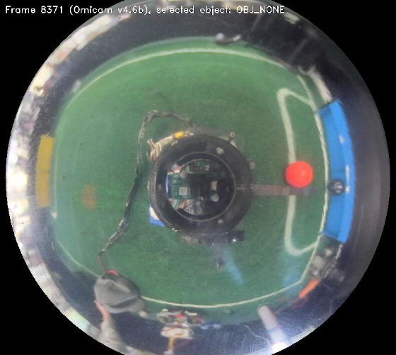

    

_Page author: Matt Young, vision systems & low-level developer_

One of the biggest innovation Team Omicron brings this year is our high-performance, custom vision and localisation
application (i.e. camera software) called _Omicam_. This replaces our old setup, which used to use the OpenMV H7. Omicam
handles the complex process of detecting the ball and goals, determining the robot's position on the field as well as
encoding/transmitting this information, all in one highly optimised codebase. It uses a novel method involving
2D non-linear optimisation to calculate the robot's position.

The application is developed mostly in C, with some C++ code to interface with OpenCV. 
It runs on the LattePanda Delta 432 single board computer and uses Linux (Xubuntu 18.04) as its OS.

We are proud to report that Omicam is a significant improvement compared to previous vision applications in use at BBC
Robotics, as explained in the "Performance and results" section.

## Background and previous methods
Intelligent, accurate and fast computer vision continues to become increasingly important in RoboCup Jr Open Soccer.
With the introduction of the orange ball and advanced teams' application of "ball-hiding" strategies, high resolution
yet performant computer vision is now one of the most important elements of a successful RoboCup Jr Open robot. Advanced
teams now also need to accurately estimate their position on the field (localise) in order to execute strategies and
gain the upper hand in the competition.

Previously, our team used an OpenMV H7 to provide vision. This is a module which uses an STM32 MCU combined combined
with an OmniVision camera module to provide low-resolution vision in an easy-to-use MicroPython environment. However,
although this approach is functional, its resolution and framerate are extremely limiting for our use case. Hence, we
decided the best solution was to develop a custom vision application running on a [single board computer (SBC)](sbc.md). 
In terms of localisation, in the past we managed to get away with not using any, or using a low-fidelity approach based
on detecting the goals in the image. With the introduction of strategies this year, however, team members needed more
accurate position data, which requires more complex localisation.

## Performance and results
Omicam is capable of detecting the ball, goals and lines at 60-70fps at 720p (1280x720) resolution. 
Compared to the previous OpenMV H7, this is 23x higher resolution at 3x the framerate.1

In addition, using the novel vision-based localisation algorithm we developed this year, we can now determine the
robot's position to around 1.5cm accuracy in less than 2ms. This is over 5x/25x more accurate2
than any previous methods used at BBC Robotics, most likely much faster, and has been shown to be much more reliable and 
stable in all conditions.

Using the e-con Systems Hyperyon camera based around the ultra low-light performance IMX290 sensor, Omicam
is robust against lighting conditions ranging from near pitch darkness to direct LED light.

_1: previous results based on mediocre lighting conditions running well optimised OpenMV H7 code at QVGA resolution._ 

_2: depending on whether LRF based/goal based localisation was used._

## Hardware
Omicam is capable of running on any x86 computer running Linux. In our case, we use a LattePanda Delta 432 SBC with a 
2.4 GHz quad-core Intel Celeron N4100 and 4GB of RAM. All computer vision tasks run on the CPU, we do not use the GPU.

The camera module we use is the e-con Systems Hyperon which uses the IMX290 ultra-low light image sensor.

For more information, please see [this page](sbc.md).

## Field object detection
One of the responsibilities of Omicam is to detect the bounding box and centroid of field objects: the ball, goals and also lines. 
This is accomplished by using the open-source computer vision library OpenCV. 
We use a Gstreamer pipeline to decode our camera's MJPEG stream at our target resolution of 1280x720 pixels, which is
read in through an OpenCV `VideoCapture` object.

   
_Figure 1: image captured directly from Omicam, showing how it views the field (note: downscaled for docs)_

### Pre-processing
With the camera frame in OpenCV memory, we then apply the following pre-processing steps to the image:

1. Crop the frame to only leave a rectangle around the mirror visible
2. Flip the image, if necessary, to account for the mounting of the camera on the robot
3. Apply a circular mask to the image to mask out any pixels that aren't on the mirror
4. Downscale the frame for use when processing the blue and yellow goals to process faster at the cost of accuracy
5. Mask out the robot from the centre of the mirror (as it has reflective plastic on it which comes up as white)

### Thresholding and component labelling
After pre-processing, we then use OpenCV's `inRange` inside a `parallel_for` to threshold all objects at once using
multiple threads. 
This produces a 1-bit binary mask of the image, where each pixel is 255 (true) if it's inside the RGB range specified, 
and 0 (false) if it's not.

For the lines, the vision processing step is finished here as we only need a binary mask. Unfortunately, the localisation
process can't begin until the goals have finished processing due to the localiser relying on the goals in its initial
estimate calculations (see below).

Finally, we use OpenCV's Grana[^1] parallel connected component labeller to detect regions of the same colour in the image.
The largest connected region will be the field object we are looking for. 
OpenCV automatically calculates the bounding box and centroid for each of these connected regions.

### Coordinate transforms and dispatch
Considering the centroid for each field object as a Cartesian vector in pixels coordinates, we convert this vector to
polar form and run the magnitude through our mirror dewarping function (see below) to convert it to a length in 
centimetres. This leaves us with a polar vector for each field object relative to the robot's centre.

We then convert back to Cartesian and use the last localiser position to infer the field object's absolute position in centimetres. 

Finally, for the goals we also calculate the relative Cartesian coordinates (convert polar to Cartesian but don't add 
localiser position) for use in the localiser's initial estimate calculations.

This information is encoded into a Protobuf format with nanopb, and is sent over UART to the ESP32 using POSIX termios
at 115200 baud. Unfortunately, the UART bus is owned by an ATMega 32U4, so a sketch on that device forwards it
to the ESP32.

**TODO images and/or video of thresholded field**

**TODO more detail on dewarp function here (maybe move stuff up from localisation section)**

## Localisation
### Previous methods and background
Localisation is the problem of detecting where the robot is on the field. This information is essential to know in order
to develop advanced strategies and precise movement control, instead of just driving directly towards the ball. In this
section, we give a brief overview of the known methods teams currently use to localise and their benefits/drawbacks.

The most common approach uses the detected goal blobs in the camera to triangulate the robot's position. This approach
can be very inaccurate because of the low resolution of most cameras (such as the OpenMV), the fact that there are only
two goals to work with as well as the fact that sometimes the goals are not visible (especially in SuperTeam). Using
this approach on an OpenMV, we found accuracy of about 15 cm, but running on Omicam at 720p we found accuracy of around
4-6 cm. However, if the goals are missing, localisation is impossible.

The second approach in use is based on distance sensors such laser range finders (LRFs) or ultrasonic sensors. By using
a few of these sensors on a robot, the position of the robot can be inferred with trigonometry by measuring the distance
to the walls. The drawback of this approach is that it's impossible to reliably distinguish between interfering objects,
such as a hand or another robot, and the walls actually being looked for. This means that although this approach can be
accurate on an empty field, it is very difficult to use reliably in actual games. On an empty field, teams have found
accuracies of 5-10 cm, but data is often invalid and can't be used reliably in real games.

The third approach in use by some teams is one based on 360 degree LiDARS. This approach, being similar to the second
approach, has similar accuracy and drawbacks. One additional drawback is the expensive cost and heavy weight of LiDARS.

Another approach that can be used is summing displacement values from a mouse sensor, or integrating acceleration data
from an IMU. While these approaches have high levels of accuracy initially, the repeated integration of the data 
gradually builds error over time, and if the robot is on for a particularly long time, the localised position may be
several centimetres inaccurate by the end. In addition, these approaches all return relative displacement to the 
initial position, not an absolute position on the field - meaning a method for calculating the robot's initial
position accurately is still required.

Some teams, including us in the past, do not localise at all. Strictly speaking, with many gameplay behaviours,
knowing the robot's position is not necessary. However, with our advanced strategies, localisation is a necessity.

### Our approach
This year, Team Omicron presents a novel approach to robot localisation based on a hybrid sensor-fusion/non-linear
optimisation algorithm. Our approach builds an initial estimate of the robot's position using faster, more inaccurate
methods like goal triangulation and mouse sensor displacement. It then refines this estimate to a much higher accuracy
by solving a 2D non-linear optimisation problem in realtime using the Subplex algorithm (an improvement of the well
known Nelder-Mead simplex algorithm). The addition of the optimisation stage to the algorithm increases accuracy by
about 4.6x, to be as little as 1.5cm error.

Our optimisation algorithm works by comparing observed field line geometry from the camera (sampled via raycasting), 
to a known model of the field. By trying to optimise the robot's unknown (x,y) position such that it minimises 
the error between the observed lines and expected lines at each position, we can infer the robot's coordinates to a 
very high level of accuracy.

The optimisation stage of our sensor fusion algorithm is based on a paper by Lauer, Lange and Redmiller (2006) [^2], as
covered in the paper by Lu, Li, Hu and Zheng (2013) [^3]. However, our approaches are different in certain areas, with
us making some concessions and improvements to better suit the RoboCup Junior league (as the paper was written for
middle-size league). Lauer et al's approach casts rays and marks points where these rays intersect the lines, whereas we
work with these rays and their lengths directly. Their approach also calculates the orientation of the robot, while we
trust the value of the IMU for orientation to simplify our algorithm. Their optimisation stage uses the RPROP algorithm
to minimise error, while we use Subplex (based on the Nelder-Mead simplex algorithm). Finally, Lauer et al's approach
has more complex global localisation and smoothing that can handle unstable localisations with multiple local minima,
while our approach assumes only one minimum is present in the objective function.

We further explain our method by dividing it into the following 6 main processes:

1. Estimate calculation
3. Image analysis
4. Camera normalisation
5. Coordinate optimisation and interpolation
6. (Optional) Robot detection

### Estimate calculation
The localiser first constructs an initial estimate of the robot's position using faster but more inaccurate methods.
The preferred method is to sum the displacement data from our PWM3360 mouse sensor to determine our current position 
since last localisation. However, in certain cases such as the initial localisation after the robot is powered on,
we also use the blue and yellow goals to triangulate our position since there's no initial position for the mouse 
sensor to use. Once we have an initial localisation, we can go back to using the mouse sensor data.

    
_Figure 2: method for triangulating position using goals coordinates and vectors_

Once the initial estimate is calculated, which is usually accurate to about 6-10cm, we constrain the optimiser's bounds
to a certain sized rectangle around the centre of the estimated position. We also change the optimiser's initial
starting position to the calculated initial estimate, and scale down its step size significantly. We assume that the
estimate is close to the actual position, so a smaller step size means that it won't overshoot the minimum and will
hopefully converge faster.

If the localiser isn't constrained to the initial estimate bounds, especially on the internationals field we found it
could be very unstable and would often get stuck in nonsensical positions like the corners of the field or inside
the goals. Constraining the optimiser to the estimate bounds is very helpful to reduce these problems, and it also
provides performance benefits as well (since the optimisation algorithm searches less ground).

### Image analysis
The localiser's input is a 1-bit mask of pixels that are determined to be on field lines. This is determined by thresholding
for the colour white, which is handled by the vision pipeline described earlier.

With the input provided, a certain number of rays (usually 64) are emitted from the centre of the line image. A ray
terminates when it touches a line, leaves the image frame or reaches the edge of the mirror (as it would be a
waste of time to check outside the mirror). Currently we use simple trigonometry to project this ray, although we could
use the Bresenham line algorithm for more performance.

Rays are stored as only a length in a regular C array, as we can infer the angle between each ray as: 2pi / n_rays

This step can be summarised as essentially "sampling" the line around us on the field.

   
_Figure 3: example of ray casting on field file, with a position near to the centre. Each unique ray has a random colour._

### Camera normalisation
These rays are then dewarped to counter the distortion of the 360 degree mirror. The equation to do so is determined by
measuring the pixels between points along evenly spaced tape placed on the real field, via Omicontrol. For more
information, see [this page](omicontrol.md). In our case, we simply apply the dewarp function to each ray distances
instead, leaving us with each ray in centimetre field coordinates rather than camera pixel coordinates.

This dewarping equation is also used by the vision pipeline to determine the distance to the ball and goals in centimetres.

Unfortunately, this normalisation process is the greatest source of inaccuracy in Omicontrol. It is extremely sensitive
to image resolution, camera quality, 360 mirror quality and perspective. At the furthest edges of the mirror, due to
the mirror's curvature, there is simply less data. This means that it's still difficult for us to accurately calculate
the position of the ball when it's very far away, although we can at least see it now. The best solution to this problem
would be a new mirror design and a higher resolution camera (something like 1920x1080).

    
_Figure 4: results of applying the dewarp function to the entire image in Figure 1. This would take too long to calculate_
_on the SBC, so we only dewarp ray distances instead._

The second phase of the camera normalisation is to account for the robot's orientation by rotating the casted rays
relative to the robot's current angle, as reported by the BNO-055 plugged into the ESP32. While we could actually have
the optimiser solve for the robot's orientation as well as it's coordinates, we have found the BNO-055 good enough
to trust its instead of solving for them ourselves.

### Coordinate optimisation and interpolation
The coordinate optimisation stage is achieved by using the Subplex local derivative-free non-linear optimisation
algorithm [^4], implemented as part of the NLopt package[^5]. This algorithm essentially acts as an efficiency and
stability improvement over the well-known Nelder-Mead Simplex algorithm. Subplex is capable of quickly solving systems
that have no calculable derivatives with hundreds of variables, so in our case solving a two dimensional problem is
trivial for it. Due to the fact that our system is overdetermined, it is not easy to solve and hence why we have to
generate an approximate solution using an optimisation algorithm like Subplex (although, as mentioned later, it
should be possible to generate a least squares solution).

Our problem description is as follows:

The most important part of this process is the _objective function_, which is a function that takes an N-dimensional
vector (in our case, an estimated 2D position) and calculates a "score" of how accurate the value is.

   
_Figure 5: map of objective function for a robot placed at the centre of the field. White pixels indicate high accuracy areas_
_and black pixels indicate less accurate areas. This takes up to 30 seconds to calculate for all 44,226 positions (this shows_
_why a brute force search would not work in competition)._

    
_Figure 6: another visualisation of the objective function, instead shown by treating it as a heightmap in Blender._

The known line layout/geometry of the RoboCup field is encoded into a "field file". This is a binary Protocol Buffer
file written to disk, and is essentially a bitmap where 1 pixel = 1cm, white if line and black if no line. The reason
for recording it as a Protobuf instead of a bitmap is because the format is theoretically capable of storing grids of
any resolution, such as 0.5cm if more accuracy was desired. We use a 1cm grid, which stores 44,226 cells and is 42 KiB
on disk. This takes about 2 seconds to generate on a fast desktop computer using a Python script that can be modified
to support any field geometry such as SuperTeam or our regional Australian field.

Unfortunately, due to the expensive raycasting, calculating this objective function is very expensive. However, with
smart use of caching and memoisation, we were able to achieve enormous performance improvements (in the magnitude of
something like 100x faster). This works by having Omicam store the results of each set of raycasts it does to the static
field file to an in-memory cache. Since the field file never changes, when the optimisation algorithm needs to look up
that grid cell in future, it can simply pull the results from the cache instead of needlessly recalculating them. This
means the only raycasting we do is on the incoming camera frame, saving a heap of time. Since the robot is often still,
we have extremely low cache miss rates most of the time. In theory, it would also be possible to generate this in-memory
cache completely offline for more performance, although we currently do not.

    
_Figure 7: visualisation of the field data component of the field file. In the original 243x182 image, 1 pixel = 1cm_

With the robot's position now determined to the highest accuracy possible, the final step in the localisation process
is to smooth and interpolate this coordinate. The optimisation algorithm can produce unstable results, especially in
environments where the line is not very visible or mistaken for other objects on the field. Smoothing is currently 
accomplished by using a simple moving average. A moving median was also tried but led to more unstable results. 
In future, we would like to investigate more complex digital signal processing such as a low-pass filter or Kalman filter
to improve our accuracy.

**A short tangent on the least-squares method**

In theory, our optimisation problem could actually be represented as a non-linear least squares problem (rather than a
non-linear derivative free problem), and could thus be solved using standard algorithms like the Gauss-Newton or
Levenberg-Marquardt algorithms. This would be significantly faster than Subplex, because least-squares optimisers have
information about the gradients of the problem so they can converge in less iterations. In fact, this method has been
shown to be possible in many point-set registration papers before (which our problem is similar to). In fact, since we
don't solve for rotation, I believe the problem should be solvable entirely using total least squares, which is linear
and very fast (although I'm not totally sure on this). Although this would be a lot faster, I didn't have the
mathematical knowledge to implement any least-squares regressions by myself, so I decided to use the derivative-free
optimisers from NLopt instead.

### Robot detection
We also experimented with a novel robot detection algorithm, although it was not completed in time for release.
Initially testing shows it could be pretty accurate, especially with LiDAR instead of video.

The algorithm works under the assumption that since most robots are white, they will in turn be picked up by our line
detector. We can analyse all the lines we detect and detect outliers, or "suspicious" rays, which will belong to robots.
We do this using the standard method of checking if a value lies 1.5x outside the interquartile range (IQR). Once that
is done, we cluster groups of suspicious rays one after the other into unbroken blobs that could be robots. With this,
we essentially have a triangle of where the robot could be in (the back face of the triangle is set to be along the
nearest line). To check if a robot does in fact lie in this triangle, we check to see if a circle the size of the
largest legal robot diameter could fit into the triangle. If the circle fits anywhere, we have a detection - otherwise,
it's a false positive. Although it's impossible to know exactly where the robot is located in this triangle, we assume
that it will be located the closest possible distance to the robot without clipping outside the bounds (we essentially
"inscribe" the circle within the triangle this way). With that done, we have successfully detected the (x,y) position of
a potential opposition robot!

**TODO image**

This algorithm has its limitations, because it makes many assumptions that are not necessarily true such as robots being
white or fitting in the inscribed circle. Nonetheless, we believe it would be useful enough in competition to be another
helpful feature of Omicam.

### Limitations and refinements
Although a lot of effort has been spent improving the performance of our approach, some issues with it remain:

- Accuracy can still be improved. Although 1.5cm is good, it's still a margin of error that may make some more precise
movements difficult.
- The algorithm can be unstable, especially on internationals fields where lines are harder to see. The initial estimate
stage and optimiser bounds helps to correct this, but a better algorithm for detecting lines (perhaps using a Sobel filter)
should be looked into.
- On a related note, the optimiser probably needs too many lines visible to generate a stable position. In fact, this
limitation is what led us to develop the hybrid sensor-fusion/optimisation algorithm instead of just optimising
directly. In the real world, just optimising was too unstable when lines weren't visible, compared to idealistic
simulation renders.
- The optimisation stage could be solved more intelligently by representing it as a least-squares problem instead of
a derivative-free problem, as mentioned above.
- The algorithm is difficult to debug. Despite programming tools for Omicontrol, it's still difficult to determine exactly
why the algorithm won't localise sometimes, which could be a problem at competitions. Although this is expected from a 
complex approach, more debugging tools should be programmed to assist with this.
- To generate a better final position, a low pass filter or even Kalman filter could be used instead of a simple moving
average.

## Extra/miscellaneous features
Omicam also has many additional features outside of vision!

### Interfacing with Omicontrol
To interface with our remote management application Omicontrol, Omicam starts a TCP server on port 42708. This server sends
Protocol Buffer packets containing JPEG encoded frames, zlib compressed threshold data as well as other information such as
the temperature of the SBC. The TCP listen thread receives messages from the Omicontrol client, decodes them and executes
the specified action ID (for example, save data to disk) if one is specified. The TCP send thread receives data from
the vision and localisation pipelines, and encodes them an sends them over network.

One important feature of the Omicam and Omicontrol connection is its ability to operate at high framerates, while not
using a ridiculous amount of bandwidth (even though it's meant to be connected locally, we wanted to keep bandwidth
under 2 MB/s). To achieve this, we use the SIMD optimised `libjpeg-turbo` library to efficiently encode camera frames to
JPEG, so as to not waste performance on the remote debugger (which is disabled during competition). Instead of
compressing threshold frames with JPEG, because they are 1-bit masks, we found that zlib could compress them
more efficiently (around about 460,800x reduction in size compared to uncompressed data, likely due to this being a 
great use case for zlib's run-length encoding). 

### Configuration
Usually, we embed configuration in a "defines.h" file. Config includes information like the bounding box of the crop
rectangle, the radius of the mirror and the dewarp function.

Because this is embedded in a header, the project would have to be recompiled and relaunched every time a setting is
updated which is not ideal. For Omicam, we used an INI file stored on the SBCs disk that is parsed and loaded on every
startup. In addition, the config file can also be dynamically reloaded by an Omicontrol command, making even relaunching
Omicam un-necessary. Because of this, we have much more flexibility and faster prototyping abilities when tuning to
different venues.

### Video recording
Omicam can record its vision output to disk as an MP4 file. When this is enabled in the configuration, a thread is started
that writes video frames to an OpenCV `VideoWriter` at the correct framerate to produce a stable 30 fps video. These
generated videos can be loaded as Omicam input (instead of using a live camera), which is useful for offline testing.
In this way, games can be recorded for later analysis of Omicam's performance and accuracy, or for entertainment value.

### Replay system
Similar to the above, we also added a "replay" system (although it wasn't fully finished). When enabled, Omicam records
the data it calculates about the robot's position and orientation to a binary Protobuf file on disk at a rate of 30 Hz.
This format is compact and fault tolerant. The file is periodically re-written every 5 seconds (in case of the app crashing),
and we roughly estimate it should be able to encode ~45 minutes of gameplay data in only 16MB. 
See our [Omicontrol](omicontrol.md) section for more details on how this would have looked.

### Debugging and diagnostics
Low-level compiled languages such as C and C++ can be difficult to debug when memory corruption or undefined behaviour
issues occur. In addition, many latent bugs can go undetected in code written in these languages. In order to improve
the stability of Omicam and fix bugs, we used Google's Address Sanitizer (ASan) and Undefined Behaviour Sanitizer
(UBSan) to easily find and trace a variety of bugs such as buffer overflows, memory leaks and more. This (usually) works
in parallel with gdb.

To assist in performance evaluation, we used the Linux tool OProfile to determine the slowest method calls in the application.

## Conclusion
This year, Team Omicron presents a high-performance, custom vision and localisation application called Omicam. It is 
written mainly in C, and runs on a LattePanda Delta 432. It is capable of processing vision at orders of magnitude faster
than our previous solution, the OpenMV H7. We also present a novel approach to robot localisation, based on sensor-fusion
and 2D non-linear optimisation. This approach is significantly more accurate and robust than previous methods. Finally,
we introduce support for communication to our visualisation and management application, Omicontrol (covered separately)
using Protocol Buffers. In addition to all this, we also include many interesting features (though, untested) features
such as replays, dynamic config reloading and video recording.

Thank you for reading this! If you have any questions, please don't hesitate to contact us.

## References
[^1]: C. Grana, D. Borghesani, and R. Cucchiara, “Optimized Block-Based Connected Components Labeling With Decision Trees,” IEEE Trans. Image Process., vol. 19, no. 6, pp. 1596–1609, 2010, doi: 10.1109/TIP.2010.2044963.

[^2]: Lauer, M., Lange, S. and Riedmiller, M., 2006. Calculating the Perfect Match: An Efficient and Accurate Approach for Robot Self-localization. RoboCup 2005: Robot Soccer World Cup IX, pp.142-153.

[^3]: H. Lu, X. Li, H. Zhang, M. Hu, and Z. Zheng, “Robust and real-time self-localization based on omnidirectional vision for soccer robots,” Adv. Robot., vol. 27, no. 10, pp. 799–811, Jul. 2013, doi: 10.1080/01691864.2013.785473.

[^4]: T. H. Rowan, “Functional stability analysis of numerical algorithms,” Unpuplished Diss., p. 218, 1990.

[^5]: Steven G. Johnson, The NLopt nonlinear-optimization package, http://github.com/stevengj/nlopt
