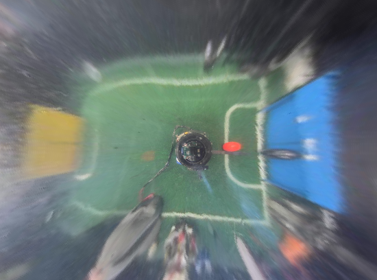

# Omicam 
One of the biggest innovation Team Omicron brings this year is our advanced, custom developed vision and
localisation application called _Omicam_. The application is developed mostly in C, with some C++ code to interface with
OpenCV. It runs on the powerful LattePanda Delta 432 single board computer and uses Linux (Xubuntu 18.04) as its OS.

We are proud to report that Omicam is a significant step up compared to previous vision applications in use at BBC
Robotics, as explained in the "Performance and results" section.

Omicam consists of **X** lines of code, and took about **X** hours to develop.

## Background and previous methods
Intelligent, accurate and fast computer vision continues to become increasingly important in RoboCup Jr Open Soccer.
With the introduction of the orange ball and advanced teams' application of "ball-hiding" strategies, high resolution yet
performant computer vision is now one of the most important elements of a successful RoboCup Jr Open robot. However, detecting the
field objects (ball, goals, etc) is now only the bare minimum. Advanced teams also need to accurately estimate their 
position on the field (localise) in order to execute advanced strategies and gain the upper hand in the competition.

Previously, our team used an OpenMV H7 to provide vision. This is a module which uses an STM32 MCU combined combined with
an OmniVision camera module to provide low-resolution vision in an easy-to-use MicroPython environment. However, although
this approach is functional, its resolution and framerate are extremely limiting for our use case. Hence, we decided the
best solution was to do what the most advanced teams were doing, and develop a custom vision application running on a 
single board computer (SBC). In terms of localisation, in the past we managed to get away with not using any, or using
a low-fidelity approach based on detecting the goals in the image.

## Performance and results
Omicam is capable of detecting 4 field objects at **60-70fps at 720p (1280x720) resolution**. Compared to the previous
OpenMV H7, this is **23x higher resolution at 3x the framerate.1**

In addition, using the novel vision-based localisation algorithm we developed this year, we can now determine the
robot's position to **&lt;1cm accuracy** at realtime speeds. This is over **5x/25x more accurate2** than any previous methods 
used at BBC Robotics, and has been shown to be much more reliable and stable.

To achieve this performance, we made heavy use of parallel programming techniques, OpenCV's x86 SIMD CPU optimisations,
Clang optimiser flags as well as intelligent image downscaling for the goal threshold images (as they are mostly unused).
In addition, the localisation, vision and remote debug pipelines all run in parallel to each other so the entire application
is asynchronous.

_1 previous results based on mediocre lighting conditions running well optimised OpenMV H7 code at QVGA resolution._ 

_2 depending on whether LRF based/goal based localisation was used._

## Hardware
Omicam runs on a Linux-based LattePanda Delta 432. It uses an OV4689 USB 2.0 camera module, which is capable of streaming
motion JPEG (MJPEG) at 720p 100+ fps.

**More here, justifcations for why we picked this hardware.**

**TODO cover Omicam development with other SBCs**

## Field object detection
The primary responsibility of Omicam is to detect the bounding box and centroid of field objects: the ball, goals and also lines. 
To do this, we use the popular computer vision library OpenCV (v4.2.0). 
We use Video4Linux2 (V4L2) to acquire an MJPEG stream from the USB camera, via the popular gstreamer library.
Then, we apply any pre-processing steps such as downscaling the goal frames and gamma boosting.

Next, we threshold all objects in parallel to make use of our quad-core CPU, using OpenCV's `inRange` thresholder but a custom
parallel framework (as it doesn't run in parallel by default). Thresholding generates a 1-bit binary mask of the image, where
each pixel is 255 (true) if it's inside the RGB range specified, and 0 (false) if it's not.
Then, we use OpenCV's parallel connected component labeller, specifically the algorithm by Grana et al.[^1] to detect regions
of the same colour in the image. The largest connected region will be the field object we are looking for. OpenCV automatically
calculates the bounding box and centroid for each of these connected regions.

We then dispatch the largest detected blob's centroid via UART to the ESP32, encoded using Protocol Buffers and using
POSIX termios for UART configuration.

**TODO images and/or video of thresholded field**

## Localisation
### Previous methods and background
Localisation is the problem of detecting where the robot is on the field. This information is essential to know in order
to develop advanced strategies and precise movement control, instead of just driving directly towards the ball.

Currently, teams use three main ways of localisation. Firstly, the simplest approach uses the detected goals
in the camera to estimate the robot's position. This approach is very inaccurate because of the low resolution of
most cameras (such as the OpenMV), the fact that there are only two goals to work with as well as the fact that sometimes
the goals are not visible (especially in super team). Expected accuracy is 15-25cm.

The second approach in use is based on distance sensors such laser range finders (LRFs) or ultrasonic sensors. By using
several of these sensors on a robot, the position of the robot can be inferred with trigonometry, by measuring the distance
to the walls. This approach has a major drawback: it is impossible to reliably distinguish between anomalous objects,
such as a hand or another robot, compared to a wall. This means that although this approach is somewhat accurate on an empty
field, it is very difficult to use reliably in actual games. Thus, localisation data was almost never trusted by teams
who used this approach and so is not very helpful. In addition, distances sensors, especially ultrasonics, are slow and suffer 
from inaccuracy at long distances. Expected accuracy is 5-10cm, but data is invalidated every time a robot moves in the way of a sensor,
which is impossible to know.

The third approach in use by some teams is one based on 360 degree LiDARS. These are expensive, heavy, difficult to use, slow and are
still vulnerable to all the problems the second approach suffers from as well. We are not aware of expected accuracy, but regard
this as not an ideal approach.

### Our solution
This year, Team Omicron presents a novel approach to robot localisation based partly on a middle-size league paper by Lu, Li, Zhang,
Hu & Zheng[^2]. We localise using only RGB camera data by solving a multi-variate non-linear optimisation problem in realtime,
making inferences from the position of the lines on the game field.

The principle method of operation of our algorithm is that we need to match a virtual model of field geometry to the observed
one from the camera, thereby inferring our position. Another way to think of it is we need to generate a transform such that
a virtual model of the field will align with the real one, thereby also calculating our 2D position.  
If we match the lines so that they align in both the virtual model and real-world model, then we can infer that the 
calculated virtual robot coordinates are the same as the real, unknown robot coordinates. Essentially, we're
taking what we know: the static layout of the field, and observed field geometry at our current position, and using it to
infer the unknown 2D position vector.

This is a form of the orthogonal Procrustes problem, which can be solved through a multitude of approaches such as iterative
closest point (commonly used with 3D LiDARS), Monte-Carlo localisation via a particle filter or gradient fields. However,
most of these approaches also consider rotation as a factor. Due to to our use of a high-accuracy BNO-055 IMU, we consider
rotation to be a non-issue that can be easily corrected for, thereby reducing the complexity of the problem. 
Thus, we developed a novel three step algorithm involving ray-casting to infer our 2D position, ignoring rotation as a factor 
to be solved for.

These steps are:

1. Image analysis
2. Camera normalisation
3. Coordinate optimisation

#### Image analysis
The localiser's input is a 1-bit mask of pixels that are determined to be on field lines. This is determined by thresholding
for the colour white, which is handled by the vision pipeline described earlier.

With the input provided, a certain number of rays (usually 128) are emitted from the centre of the line image. A ray
terminates when it touches a line, reaches the edge of the image or reaches the edge of the mirror (as it would be a
waste of time to check outside the mirror). The theory of operation behind this is, essentially, for each field position
each ray should have its own unique distance.

Rays are stored as only a length in a regular C array, as we can infer the angle between each ray as: 2pi / n_rays

   
_Figure 1: example of ray casting on field, with a position near to the centre_

#### Camera normalisation
These rays are then dewarped to counter the distortion of the 360 degree mirror. The equation to do so is determined by
measuring the pixels between points along evenly spaced tape placed on the real field, via Omicontrol. Using regression 
software such as Excel or Desmos, an equation can then be calculated to map pixel distances to real distances. 
Below we demonstrate the result of dewarping an entire image (using the output of the OpenMV H7), which we deemed too 
inefficient to run in realtime.  In our case, we simply apply the dewarp function to each ray length instead.

This dewarping equation is also used by the vision pipeline to determine the distance to the ball and goals in centimetres.

    
_Figure 2: example of frame dewarping from the old, low reolution OpenMV H7_

The second phase of the camera normalisation is to rotate the rays relative to the robot's heading, using a rotation matrix.
The robot's heading value, which is relative to when it was powered on, is transmitted by the ESP32, again using Protocol Buffers.
For information about how this value is calculated using the IMU, see the ESP32 and movement code page.

**TODO: explanation on why this is done**

#### Position optimisation
The main part of our solution is the Subplex local derivative-free non-linear optimiser[^3], re-implemented as 
part of the NLopt package[^4]. This algorithm essentially acts as an efficiency and stability improvement over the well-known 
Nelder-Mead Simplex algorithm.

The most critical part of this process is the _objective function_, which is a function that takes an N-dimensional vector
(in our case, an estimated 2D position) and calculates essentially a "score" of how accurate the value is. This
objective function must be highly optimised as it could be evaluated hundreds of times by the optimisation algorithm.

   
_Figure 3: map of objective function for a robot placed at the centre of the field. White pixels indicate high accuracy areas_
_and black pixels indicate less accurate areas._

A naive approach, where every grid cell is evaluated and the lowest value is picked, would require 44,226 objective function
evaluation which takes about 5 seconds on a fast computer. Using the Subplex optimiser, this can be reduced to just 62
evaluations for a 1.2mm accurate fix.

**TODO: cover approaches we drafted: line points, etc. Also, use more images in the docs**

We spent a great deal of effort drafting the most efficient objective function, and the approach we present makes heavy use
of pre-computation via a "field file". This field file is a binary Protcol Buffer file that encodes the geometry of any
RoboCup field by dividing it into a grid, where each cell is true if on a line, otherwise false. Increasing
the resolution of the grid will increase its accuracy, but also significantly increase its file size. We use a 1cm grid,
which stores 44,226 cells and is 42 KiB on disk. This takes about 2 seconds to generate on a fast desktop computer, and
is copied across to the LattePanda.
The field file is generated by a Python script which can be easily modified to support an arbitrary number of different 
field layouts, such as SuperTeam or our regional Australian field. 

Although the field file could theoretically be loaded
via the bitmap image below, images are more difficult to load than Protobuf files and it would not support grid cell sizes
smaller or larger than 1cm.

    
_Figure 3: bitmap image displaying generated field file. In the original 243x182 image, 1 pixel = 1cm_

The objective function essentially compares the difference between the ray lengths, as follows:

1. Consider the estimated position (eX, eY). Move to (eX, eY) in the field file and raycast out to generate the array
   `expectedRays`.
2. For each ray in the dewarped `observedRays` from the camera (which are now in field units, same as `expectedRays`),
   do the following: `totalError += abs(expectedRays[i] - observedRays[i])`

Although a derivative-based algorithm may be more efficient at solving the problem, we deemed it far too difficult to calculate
the derivative of the objective function.

### Adding new sensor data to the world model
Our localisation algorithm is also flexible with new sensor inputs. Due to the use of a "virtual world model" approach, if
any sensors can be modelled as a measurement of a distance to a static object, then they can be integrated as extra data
in the world model.

This is extremely helpful when vision data runs into limitations, for example, in SuperTeam where it may be difficult
to see enough field lines in one frame due to the size of the field. We integrate the LRFs on the robot as
extra distance sensors, using their reported distance to the field walls just as we use the raycasted "line points" in
the vision based approach.

It would also be possible to use the distance to the goals as virtual information to supplement a potential lack of line
data and thus increase accuracy. Other distance sensors such as 360 LiDARS can also be implemented with ease.

## Interfacing with Omicontrol
To interface with our remote management application Omicontrol, Omicam starts a TCP server on port 42708. This server sends
Protocol Buffer packets containing JPEG encoded frames, zlib compressed threshold data as well as other information such as
the temperature of the SBC. Although C isn't an officially supported language by Google for Protocol Buffers, we use the mature
nanopb library to do the encoding. This is the same library used on the ESP32 and Teensy as well, and so far we've had no
issues with it.

We use the SIMD optimised libjpeg-turbo to efficiently encode JPEG frames, so as to not waste performance to the remote debugger
(which is disabled during competition). Instead of compressing threshold frames with JPEG, because they are 1-bit images,
it was determined that zlib could compress them more efficiently (around about 460,800x reduction in size). 

With all these optimisations, even at high framerates (60+ packets per second), the remote debug system uses no more than
1 MB/s of outgoing bandwidth, which is small enough to work reliably on both local and Internet networks.

## Debugging and performance optimisation
Low-level compiled languages such as C and C++ are notoriously unstable and difficult to debug. In order to improve the stability of Omicam
and fix bugs, we used Google's Address Sanitizer to easily find and trace a variety of bugs such as buffer overflows,
memory leaks and more. In addition, we used the LLVM toolchain's debugger lldb (or just gdb) to analyse the application frequently.

To assist in performance evaluation, we used the Linux tool OProfile to determine the slowest method calls in the application.
Although the Clang compiler may have marginally worse performance than GCC, we chose Clang because it's more modern and has
better debugging support (namely, GCC's Adress Sanitizer implementation is broken for us).

To improve performance of the localiser, we use the last extrapolated position from the mouse sensor as a seed for the initial
position of the next search. This means instead of starting from a random position, the localiser will complete much quickly
a it's already relatively close to the true position.

**Also cover Linux CPU optimisation and associated thermal issues if relevant**

## References
[^1]: C. Grana, D. Borghesani, and R. Cucchiara, “Optimized Block-Based Connected Components Labeling With Decision Trees,” IEEE Trans. Image Process., vol. 19, no. 6, pp. 1596–1609, 2010, doi: 10.1109/TIP.2010.2044963.

[^2]: H. Lu, X. Li, H. Zhang, M. Hu, and Z. Zheng, “Robust and real-time self-localization based on omnidirectional vision for soccer robots,” Adv. Robot., vol. 27, no. 10, pp. 799–811, Jul. 2013, doi: 10.1080/01691864.2013.785473.

[^3]: T. H. Rowan, “Functional stability analysis of numerical algorithms,” Unpuplished Diss., p. 218, 1990.

[^4]: Steven G. Johnson, The NLopt nonlinear-optimization package, http://github.com/stevengj/nlopt
