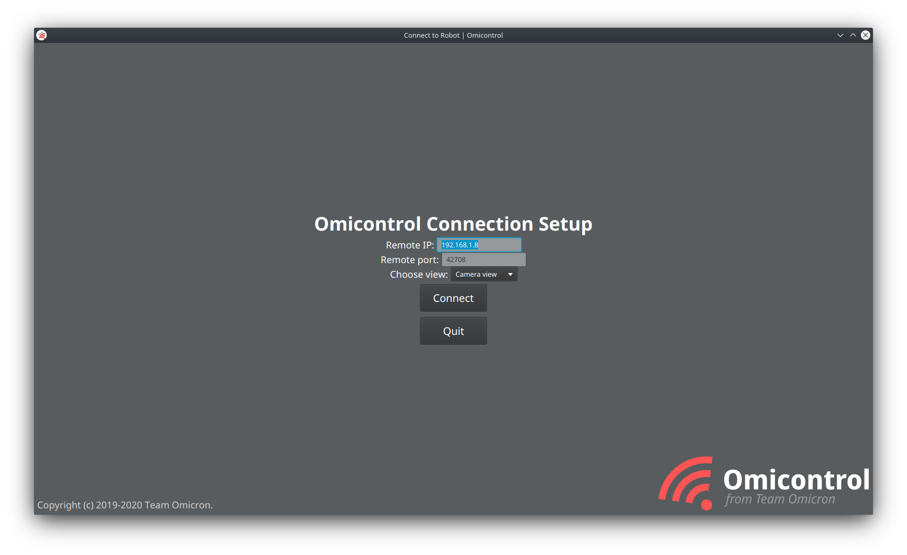

    
Omicontrol is Team Omicron's wireless robot/camera debugging and management application. With the creation of Omicam,
we needed a way of visualising camera output, managing the SBC and editing thresholds. In the past, we used the OpenMV IDE,
but given that Omicam is entirely custom developed, this meant we also had to custom-develop our own camera application.

In addition, with our new advanced strategies and localisation, as well as the potential auto referee future rule addition,
we felt like this year was a good time to add a remote robot management feature with the ability to reposition, reorient
and automatically reset robots on the field wirelessly, as well as visualise their positions. 

We added both of these features into Omicontrol, to make it essentially our all-in-one robot management application.
Because the application will be used frequently in debugging as well as in the high-pressure mid-game interval, Omicontrol's
primary design goals are to be easy to use and reliable.

Omicontrol is a cross-platform application that works on Windows, Mac and Linux. It's developed in Kotlin
and uses JavaFX for the GUI, via the TornadoFX framework.

    
_Figure 1: Omicontrol main window running on KDE neon_

**TODO: maybe make the above a video demonstration fo Omicontrol**

## Views
Omicontrol functions through the concepts of "views", which provide different information about different aspects of our
robot(s).

### Camera view
The Camera View can to view camera output and tune threshold parameters.

### Field view
Similar to teams in the major league, we implement a Field View to display the robots' localised positions and enable
control of them.

### Calibration view
This view is used to calibrate the mirror dewarp model, which translates pixel distances from the centre of the mirror
into centimetre distances on the real field. In the past, this was complex and could take upwards of half an hour.
We decided this process could be greatly streamlined, so we added the calibration view to Omicontrol.

The general flow of generating a mirror model is this process:

1. Lay out a ruler, with clear tape every 5cm
2. Start Omicam and Omicontrol, and open the Calibration View
3. Click on each of the 5cm strips in order to generate data points
4. Select the regression type (exponential or polynomial)
5. Click "Calculate model"
6. Copy the results into the `mirrorModel` field in Omicam and refresh the config file

This approach streamlines mirror model calculation from being a painstaking 30 minute task, into one which can be
done in a few button presses in under 5 minutes.

**TODO talk about auto fill in data thing when you click**

### Model calculation process
Once the user has selected a set of points, and the pixel and corresponding centimetre distances have been determined,
we now have an interesting problem to solve. Essentially, we have to interpolate this dataset so that for any pixel
distance we have, we can generate a corresponding centimetre distance. Ideally, this interpolation method would be accurate
for data points that were not observed in the dataset as well (for example, they're larger than the largest sampled point
distance).

This means there's two categories of algorithms we can use: curve fitting and polynomial interpolation. Curve fitting, or
a regression, performs a mathematical optimisation routine to optimise the coefficients for an actual function. Polynomial
interpolation uses a series of polynomials to interpolate between data points. Examples of polynomial interpolation methods
include Lagrange polynomials, Newton polynomials and also spline-based methods like cubic splines. The trouble with
polynomial interpolation is that it doesn't generalise to points outside the sampled dataset, whereas a regression does.
Because a regression generates coefficients for a mathematical model, in theory, it can extend with some accuracy outside
the dataset, whereas polynomial interpolation just interpolates inside the dataset. Because of this, we decided to use
a regression to generate our mirror model.

The two models we chose to use for our regression were an N-th order polynomial and an exponential in the form
`f(x) = ae^(bx)`. As both of these models are non-linear, we need to do a non-linear least squares regression to 
calculate the coefficients. In the polynomial this is N unknowns, and in the exponential it's just `a` and `b`. Traditionally, we used to export the data to Excel and have it calculated in there, but we decided instead
to implement the regression ourselves to increase the speed of the mirror calculation process.

To perform our least squares regression, we use the Apache Commons Math library and its `AbstractCurveFitter`.
This internally uses the
Levenberg-Marquardt algorithm, an improvement over the Gauss-Newton algorithm, to converge on the most optimal values
for the unknown coefficients.

Although Commons Math has a built in `PolynomialCurveFitter` which can fit a `PolynomialFunction`, there is no 
exponential curve fitter or exponential function provided, so we built our own `ExponentialCurveFitter` and `ExpFunction`
with value and gradient vector.

Finally, we also calculate the coefficient of determination (R2 value) to analyse the accuracy of the model.
Commons Math has no built-in way of finding the R2 value from the result of an `AbstractCurveFitter`
implementation, so instead we implemented it ourselves by calculating the residual sum of squares and total sum of squares
[as explained here](https://en.wikipedia.org/wiki/Coefficient_of_determination#Definitions).

## Wireless connection
Being able to connect to any robot wirelessly and manage it can be a great quality of life improvement when debugging
fast moving robots. There are a variety of wireless protocols in existence such as
Bluetooth Classic, Bluetooth LE, Zigbee and others. However, we decided to use TCP/IP over WiFi because it's easy to
setup and reliable, compared to Bluetooth which has issues on many platforms.

To accomplish this, the LattePanda SBC creates a WiFi access point (with no internet connection) that the client computer
then connects to, establishing a direct link between the two computers. As shown in Figure 1, the user simply types
the local IP to connect and everything else is handled for them.

Due to the nature of TCP/IP, we interestingly also have Omicontrol across the Internet. In this setup,
an Internet-connected router hosts the LattePanda device on its network via Ethernet or WiFi. The router must port forward
port 42708 which is used for Omicam to Omicontrol communications. Then, the client computer in an entirely different location,
even a different country, connects to the Omicam router's public IP address and can interact with the camera and robots
as normal. While this is interesting, nonetheless it's not used in practice due to lack of security, lack of need and
Omicam's high bandwidth requirements (as it's designed for local connections).

## Wired connection
Although wireless connection is very flexible, on the LattePanda it comes at the cost of a very poor connection in some
situations and on some SBCs, unfortunately such as the LattePanda. Thus, we decided to use gigabit Ethernet as an alternative 
connection type. This also acts as a backup in case the venue bans WiFi hotspots (as has happened before), or there's too much signal 
noise to connect properly.

This works by using a special Ethernet crossover cable and creating a simple network through assigning static IPs. The user
can simply connect to the static IP they assigned the SBC. Just like the WiFi setup, this creates an offline connection 
between the two devices at a very high bandwidth and stability. We experience no connection issues at all over Ethernet 
(although there are some occasional issues with SSH).

## Communication protocol
The backbone of bidrectional Omicam to Omicontrol communication is a simple TCP socket on port 42708, with Omicam as the host
and Omicontrol as the client. This works both for wireless and wired connections.

Communication between the two devices makes heavy use of Protocol Buffers, on the Omicam side via nanopb, and on the 
Omicontrol end in Kotlin via the official Java API from Google (which also works with Kotlin). One of the benefits of
Protocol Buffers is that both Omicam with nanopb and Omicontrol with the Java API share the exact same Protobuf definition
file (`RemoteDebug.proto`), they just are the result of different code generators. This means that as long as both the Java
and C code is generated at the same time, they are guaranteed to be compatible with each other.

Internally, Omicontrol creates a thread to manage the
TCP connection in the `ConnectionManager` class which handles encoding and transmitting Protocol Buffer data over 
the socket, as well as detecting errors in the connection. All of the code that awaits a response from the remote runs
in a separate thread to the JavaFX UI thread so that the UI isn't locked up every time a response is queued.

When a button in Omicontrol is clicked, this thread encodes and transmits a Protocol Buffer message to Omicam and waits
for a response asynchronously, notifying the calling thread once one is received.

**Should put more info here, stuff like how we basically have budget RPC with protobuf**

## Design considerations
The Omicontrol UI was designed to look professional, be simple to use, friendly to use as a tablet and work cross-platform.

**Cover how we achieved these design goals. It's just like digisol (yay.....)**